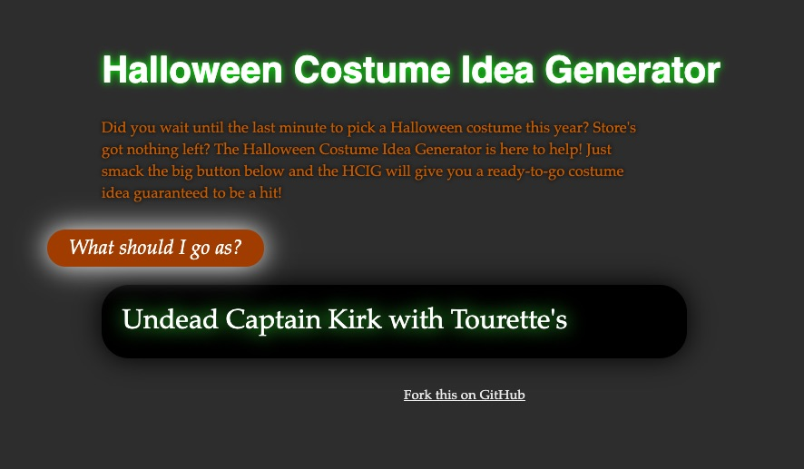

costume-idea-gen
================

The Halloween Costume Idea Generator

http://mhairston.github.io/costume-idea-gen/

TODO:
- Update vocabulary
- Add checks to avoid repeating the same parts within 5 or so runs.
- Add some illustrations based on program outputs.
- and of course, make a generalized generator from this.
                                                                                                                           
